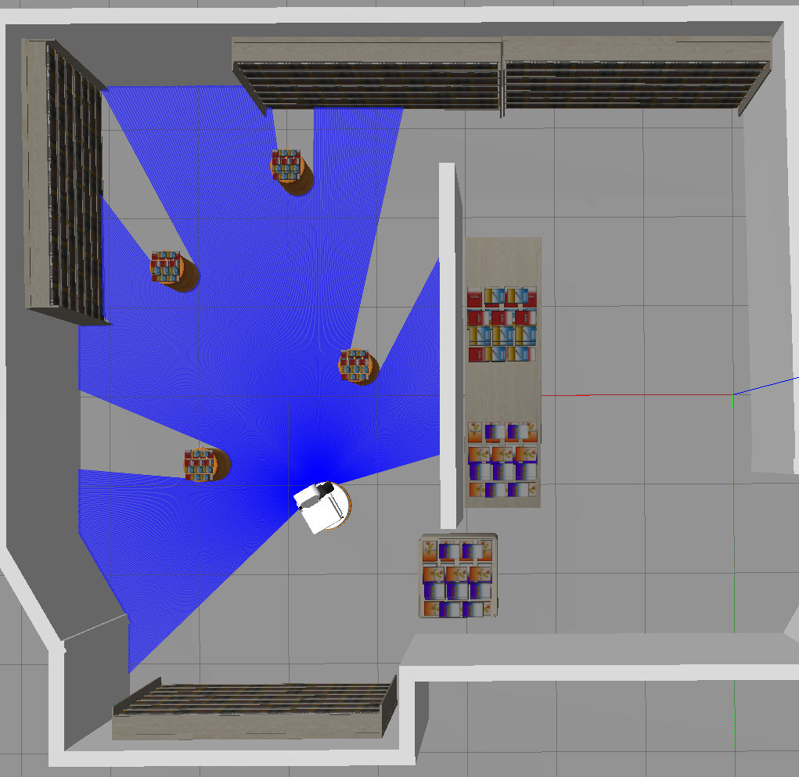
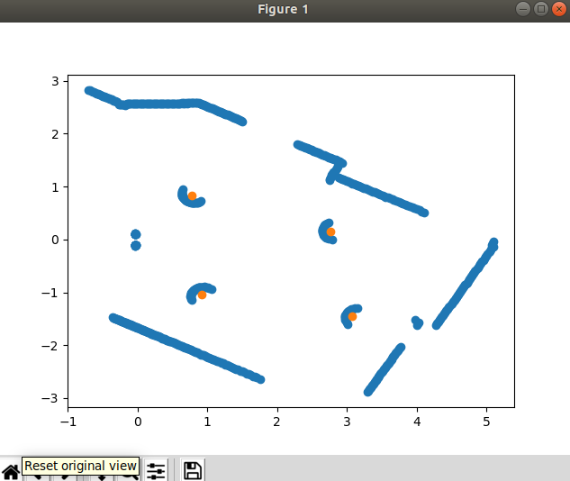

# Tiago Navigation and Obstacle Detection

This repository contains the code and documentation for the Tiago Navigation and Obstacle Detection project.

## Project Overview

The goal of this project is to develop a robust navigation system for the Tiago robot, enabling it to autonomously navigate to a predefined pose while concurrently detecting movable obstacles using laser scan data.

## Project Structure

The project is structured as follows:

- `src/`: Contains the source code for the project.
  - `move_client.py`: Action Client for specifying destination pose.
  - `move_server.py`: Action Server for navigation and obstacle detection.
  - `scan.py`: Laser scan data processing for obstacle detection.
- `launch/`: Contains ROS launch files.
  - `first_assignment.launch`: Launch file to run the project with a specified destination pose.
- `imgs/`: Contains images used in the project documentation.

## Dependencies

- Robot Operating System (ROS): Kinetic or later version.
- Tiago simulation environment.

## How to Compile

To compile the project, use the following commands:

1. Start the simulation environment:

    ```bash
    roslaunch tiago_iaslab_simulation start_simulation.launch world_name:=ias_lab_room_full
    ```

2. Launch the navigation stack:

    ```bash
    roslaunch tiago_iaslab_simulation navigation.launch
    ```

3. Run the project with the specified destination pose:

    ```bash
    roslaunch tiago_iaslab_simulation first_assignment.launch x:=11 y:=0 z:=0
    ```

## Results

The implemented system successfully fulfills the specified objectives. Tiago adeptly navigates through the environment, achieving the predefined pose, and accurately detects movable obstacles using laser scan data.





## Conclusion

This report outlines the development of a sophisticated navigation and obstacle detection system for the Tiago robot utilizing ROS. The application of an Action Client/Server structure, coupled with a modular code design and seamless integration with laser scan data, demonstrates a proficient application of robotics programming principles.

For any questions or issues, feel free to contact the author: Amir Mahdi Amani.
